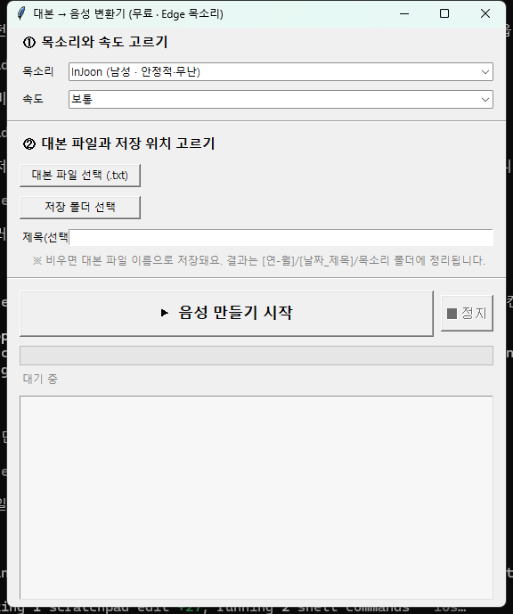

# 대본 → 음성 자동 변환기 (Script to Speech)


## 스크린샷



*무료판(edge-tts) 실행 화면 — 목소리·속도 선택, 대본 파일 지정, 변환 진행 로그*

> `.txt` 대본 파일의 **각 줄을 순서대로 음성 파일(mp3)로** 만들어 주는 데스크톱 프로그램.
> 코딩을 몰라도 버튼만 누르면 되도록 만들었고, 결과물은 날짜·제목별 폴더로 자동 정리됩니다.

영상 나레이션·더빙 대본처럼 **"한 줄 = 한 음성 파일"** 이 필요할 때 쓰기 좋습니다.

## 두 가지 버전

| | 폴더 | 엔진 | API 키 | 비용 |
|---|---|---|---|---|
| **무료 버전** | `edge-tts-무료/` | Microsoft Edge (edge-tts) | 필요 없음 | 무료 |
| **유료 버전** | `elevenlabs-유료/` | ElevenLabs | 필요 (본인 키) | 사용량 과금 |

처음이라면 **무료 버전**부터 추천합니다. 키도 계정도 필요 없고 인터넷만 있으면 됩니다.

## 주요 기능

- `.txt` 파일의 한 줄 → `001.mp3`, `002.mp3` … 순서대로 생성
- 결과를 `[연-월] / [날짜_제목]` 폴더로 자동 정리 (`_목록.txt`에 파일명↔문장 매칭 저장)
- **이어하기** — 이미 만들어진 파일은 건너뛰므로, 중간에 멈춰도 다시 시작하면 이어서 진행
- 진행률 표시 · 정지 버튼 · 오류 시 자동 재시도
- (무료 버전) 한국어 목소리·속도 선택, 두 목소리를 폴더별로 나눠 동시 비교 출력
- (유료 버전) API 키·목소리 ID를 GUI에서 입력하면 `설정.json`에 자동 저장

## 사용법

### 준비물

- **Python 3** (tkinter 포함 기본 설치본이면 충분 — Windows 기준, macOS/Linux도 파이썬으로 직접 실행 가능)

### 무료 버전 (edge-tts)

1. `edge-tts-무료` 폴더의 **`실행.bat`** 더블클릭 → 필요한 라이브러리(edge-tts)를 자동 설치하고 실행됩니다.
2. 목소리·속도를 고르고, 대본 `.txt`와 저장 폴더를 선택한 뒤 **시작**.

> 직접 실행: `pip install edge-tts` 후 `python edge_tts_gui.py`

### 유료 버전 (ElevenLabs)

1. `elevenlabs-유료` 폴더의 **`설정.example.json`을 복사해 `설정.json`으로** 이름을 바꿉니다.
2. `설정.json`에 본인 정보를 채웁니다.
   - `api_key` — [ElevenLabs](https://elevenlabs.io) 프로필/설정에서 발급받은 본인 API 키
   - `voice_id` — 사용할 목소리 ID (예시 값은 기본 목소리)
3. **`실행.bat`** 더블클릭 → 대본과 저장 폴더 선택 후 **시작**.
   (프로그램 안에서 키·목소리 ID를 입력해도 되고, 입력하면 `설정.json`에 자동 저장됩니다.)

> 직접 실행: `pip install requests` 후 `python elevenlabs_gui.py`

## (선택) 실행 파일(.exe)로 만들기

각 폴더에 PyInstaller 설정(`.spec`)이 들어 있습니다.

```bash
pip install pyinstaller
cd elevenlabs-유료      # 또는 edge-tts-무료
pyinstaller elevenlabs_gui.spec
```

`dist/` 폴더에 exe가 생성됩니다. (빌드 결과물은 저장소에 올리지 않습니다.)

## 기술적 특징

표준 라이브러리 tkinter만으로 GUI를 구성해 **런타임 의존성을 최소화**(무료판 edge-tts, 유료판 requests 단 하나)했고, 합성 작업은 별도 스레드에서 돌려 UI가 멈추지 않습니다. 파일명 기반 **이어하기(멱등 재실행)**, 요청 실패 시 자동 재시도, 폴더명 불가 문자 정리(sanitize), PyInstaller `frozen` 여부를 감지해 exe 옆에 설정을 저장하는 경로 처리 등 비개발자 배포를 전제로 한 견고성 디테일을 담았습니다. ElevenLabs 연동은 SDK 없이 REST API(`xi-api-key` 헤더)를 직접 호출합니다.

## 보안 주의

- **`설정.json`(본인 API 키가 든 파일)은 절대 GitHub에 올리지 마세요.** `.gitignore`에 등록되어 있습니다.
- 저장소에는 키를 비운 `설정.example.json`만 올립니다.
- 실수로 키를 올렸다면 ElevenLabs 대시보드에서 해당 키를 **즉시 폐기(revoke)** 하고 새로 발급하세요.

## 라이선스

개인 용도로 자유롭게 사용하세요.
